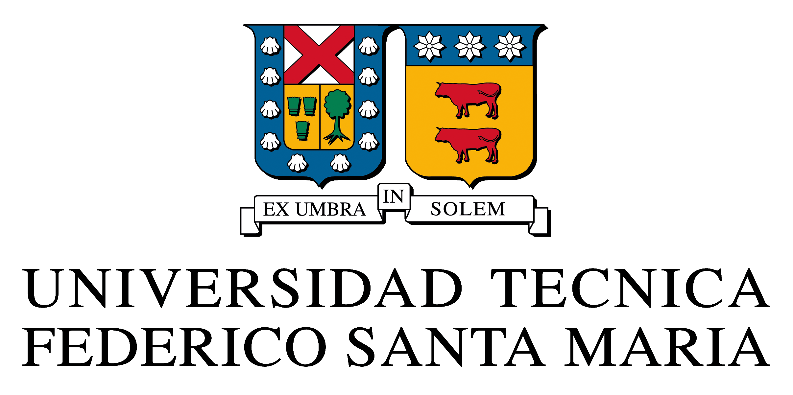

# MAT282 - 2° Semestre 2019
## Laboratorio de Modelación l

Repositorio destinado a seguir el progreso de los alumnos del curso

## Contenidos

* [Objetivos](#objetivos)
* [Avances ](#avances)

## I.- Objetivos

* EL objetivo de este repositorio es monitorear los avances de los alumnos del curso. 
* Para eso se evaluará semana a semana los distintas tareas asignadas.

### Explicación de las carpetas

* **Material**: Esta es una carpeta básica homóloga para todos los alumnos del curso. Se presenta material básico sobre python y sus librerías.

* **Proyectos**: Esta es una carpeta especializada por cada alumno en el curso. Es acá donde tendrán que ir subiendo los avances de los distintos proyectos. 

## II.- Avances

## Semana 01

### Descripción
La primera semana tendrá como objetivo que comprender aspectos básicos de python y sus principales librerías. Además, de familiarizarse con jupyter notebbok (jupyter lab), ambientes virtuales y github.

### Tareas

1. Crear una cuenta en github  y crear un proyecto que se llame igual al proyecto asignado a este curso.
2. Descargar [Anaconda](https://www.anaconda.com/distribution/).
3. Una vez descagado Anaconda, crear un ambiente virtual en python denominado **lab_modelacion** (para más información revisar el siguiente link:  [virtual_env](https://packaging.python.org/guides/installing-using-pip-and-virtual-environments/
).)
4. Crear un archivo jupyter notebook denominado **primeras_practicas.ipynb** en su repositorio, en donde expliquen a grandes rasgos:
    * Cómo instalar un ambiente virtual en python
    * Cómo manejar un proyecto en github
    * Cómo funciona las librerias  numpy, pandas y matplotlib (Para más detalles vea en la carpeta **material**)

Tiempo: 1-2 semanas.

## Semana 02

### Descripción
La segunda semana tendrá como objetivo que comprender aspectos básicos del proyecto. Para eso a cada alumno se le pedirá que realice un tutorial (en español) del proyecto.

### Tareas

1. Leer y comprender los siguientes tutoriales:
   * **Análisis de demanda mediante series temporales**: [Introduction-to-Time-Series-forecasting-Python](https://github.com/advaitsave/Introduction-to-Time-Series-forecasting-Python/blob/master/Time%20Series%20in%20Python.ipynb)
   * **Reconocimiento Facial**: [face-recognition](https://github.com/krasserm/face-recognition/blob/master/face-recognition.ipynb)
   * **Dinámica Poblacional con geolocalización**: [Kalman-Filter](https://github.com/balzer82/Kalman/blob/master/Kalman-Filter-CV.ipynb?create=1)
   
2. Crear un archivo jupyter notebook denominado **tutorial.ipynb** en su repositorio, en donde expliquen detalladamente los tópicos que abordan en cada repositorio. Por ejemplo:
   * Teoría detrás de cada proyecto
   * Principales librerías
   * Implementación 
   * Posibles mejoras
   
Tiempo: 1-2 semanas.
   
## Semana 03

### Descripción
La tercera semana tendrá como objetivo es conocer el estado del arte de los distintos proyectos. Para esto tendrán que leer lo que existe en la literatura, como se ha implementado y los resultados obtenidos.

### Tareas

1. Leer y comprender los siguientes papers:
   * **Análisis de demanda mediante series temporales**: Sales Demand Forecast in E-commerce using a Long Short-Term Memory Neural Network Methodology.
   * **Reconocimiento Facial**: DeepFace: Closing the Gap to Human-Level Performance in Face Verification.
   * **Dinámica Poblacional con geolocalización**: An Introduction to the Kalman Filter.
   
2. Crear un archivo jupyter notebook denominado **estado_arte.ipynb** en su repositorio, en donde expliquen detalladamente los temas (teoría y código).

Tiempo: 1-2 semanas.

# Semana 04

### Descripción
La cuarta semana tendrá como trabajar lo visto en el estado del arte con código en python.

### Tareas

1. Crear un archivo jupyter notebook denominado **aplicacion.ipynb** en su repositorio, en donde apliquen los resultados de su investigación en el estado del arte.

Tiempo: 1-2 semanas.
